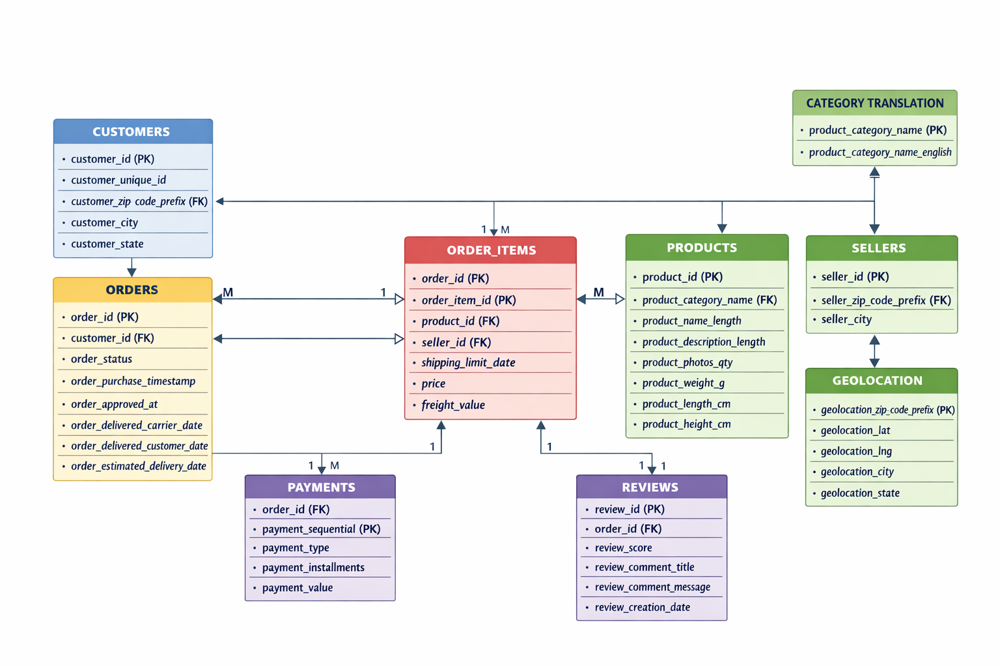

# 🛒 Olist E-Commerce Data Engineering Project

## 🚀 Overview

This project builds a **SQL-based data pipeline** using the **Olist E-commerce dataset (Kaggle)** and follows the **Medallion Architecture (Bronze, Silver, Gold)**.

The objective is to transform raw data into **clean, structured, and analytics-ready datasets**, simulating a real-world data engineering workflow.

---

## 🏗️ Architecture (ER Model)



### 🥉 Bronze Layer (Raw Data)

* Raw dataset ingested from source
* No transformations applied
* Serves as the **single source of truth**

### 🥈 Silver Layer (Data Cleaning & Transformation)

* Handling null values and duplicates
* Standardizing schema and formats
* Creating structured tables for analysis

### 🥇 Gold Layer (Analytics - Upcoming)

* Business-level aggregations
* KPI generation
* Optimized for dashboards and reporting

---

## 📊 Dataset Tables

* Customers
* Orders
* Order Items
* Products
* Sellers
* Payments
* Reviews
* Geolocation
* Category Translation

---

## ⚙️ Tech Stack

* **SQL** → Data transformation & cleaning
* **Git & GitHub** → Version control
* **Kaggle** → Dataset source

---

## 📈 Current Progress

### 🥉 Bronze Layer

* [x] All raw tables ingested

### 🥈 Silver Layer (In Progress)

* [x] Customers table cleaned & transformed
* [x] Orders table cleaned & transformed
* [ ] Order Items
* [ ] Products
* [ ] Sellers
* [ ] Payments
* [ ] Reviews
* [ ] Geolocation
* [ ] Category Translation

### 🥇 Gold Layer

* [ ] Not started

---

## 🆕 Recent Updates

### 📅 April 14, 2026

* Updated README with architecture diagram and project details

### 📅 April 13, 2026

* Cleaned and loaded `orders` table into Silver layer

### 📅 Previous Work

* Completed Bronze layer
* Cleaned `customers` table

---

## 📁 Project Structure

```
sql/
│
├── data/
    └── external
    └── raw
        └── olist datasets * 8 in csv's
├── database/
    └── bronze /
        └── DDL.sql
        └── Store-prodecure.sql
    └──silver/
        └── clean_models.sql
        └── DDL.sql
        └── prdecural.sql
    └──gold/
        └──
    └── quality /
        └── checks.sql
    └── serving /
        └── views.sql
├── docs/
    └── dataset.links.md
    └── olist_data_dictionary.md
├── notebooks/
    └── Readme.md
├── prctice /
    └── sql
├── ER diagram for Olist e-commerce system.png
└── README.md
```

---

## 🎯 Key Learnings

* Implemented Medallion Architecture in SQL
* Built layered data pipeline (Bronze → Silver → Gold)
* Performed real-world data cleaning & transformation
* Managed project using Git & GitHub

---

## 🚀 Next Steps

* Complete remaining Silver tables
* Build Gold layer (KPIs & aggregations)
* Add analytical queries
* Create dashboards (Power BI / Tableau)

---

## 🙌 Acknowledgment

Dataset: Olist E-commerce Public Dataset (Kaggle)

---

## ⭐ Support

If you found this project helpful, consider giving it a ⭐
